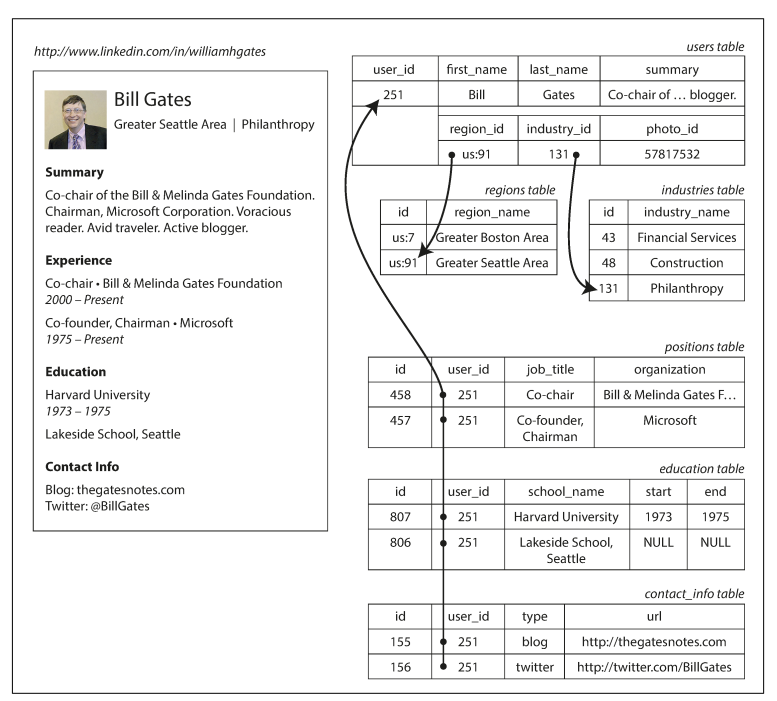
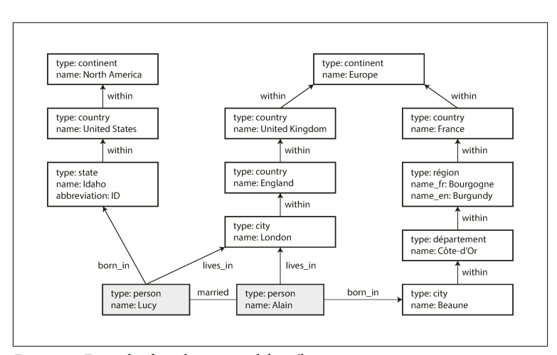

# 데이터 모델과 질의 언어

## 1. 관계형 모델과 문서 모델
관계형 모델은 1970년 에드가 코드가 제안한 모델이다. 데이터는 관계로 구성되고 각 관계는 순서 없는 튜플의 모음이다.

오늘날 웹에서 볼 수 있는 대부분의 서비스 (게시물, 소셜 네트워크, 전자 상거래, 게임 등)에 RDS가 사용된다.

## 2. NoSQL
 NoSQL은 관계형 모델의 우위를 잡으려고 하는 최신 시도이다.
NoSQL의 특징은 다음과 같다.
 - 매우 높은 쓰기 처리량 달성을 쉽게 할 수 있는 뛰어난 확장성
 - 상용 데이터베이스 제품보다 무료 오픈소스 소프트웨어에 대한 선호도
 - 관계형 모델에서 지원하지 않는 특수 질의 동작
 - 관계형 스키마의 제한에 대한 불만과 더욱 동적이고 표현력이 풍부한 데이터 모델에 대한 바람.
때문에 Not only SQL이라고 재 해석됐다.

애플리케이션은 저마다 요구사항이 다르다. 때문에 사례에 맞게 최적의 기술을 선택하는 것이 바람직하다.
가까운 미래에는 관계형 데이터베이스와 비관계형 데이터베이스가 함께 사용될 것이며, 이런 개념을 다중 저장소 속성 이라고 한다.

## 3. 객체 관계형 불일치
객체지향 프로그래밍 언어(OOP)로 개발하다 보면 객체의 관계를  SQL데이터 모델로 옮기는 것이 어려울 때가 많다.
SQL로 옮길때 불일치적인 것을 임피던스 불일치라고 부른다.

이러한 불일치를 극복하기 위해서 ActiveRecord나 Hibernate같은 ORM 프레임 워크가 등장했다.
(하지만 완벽하게 극복할 수는 없다.)


위 이미지는 전형적인 1:N관계의 데이터 구조를 보여주고 있다.
이것은 Json형식은 명시적으로 표현이 가능하며, 이러한 구조는 트리구조로 나타낼 수 있다.

## 4. 다대일과 다대다 관계
다대일과 다대다 관계에서 중요한 점은 데이터의 중복이다. 때문에 ID같은 값은 중복이 되더라도 값 자체에는 의미가 없어 변경을 할 필요가 없다.
때문에 중복 요소가 있는 주소나 지역같은 경우 ID로 대체해 조인으로 참조하는 형태가 일반적이다.
만약 조인이 없다면 애플리케이션에서 다중 질의를 만들어 코드에서 조인을 흉내내야 한다.

## 5. 계층 모델
계층 모델은 초기 IBM의 정보 관리 시스템(IMS)의 모델로 사용되었고, 이 모델은 JSON모델과 굉장히 비슷하다.
계층 모델은 모든 데이터를 레코드 내에 중첩된 레코드 트리로 표현하며, 일대 다 관계에서는 잘 동작합니다.
하지만 다대다 관계에서는 어려울 뿐더러 조인을 지원하지 않아 문제가 많았습니다.
이 문제들을 해결하기 위해 나온 것이 관계형 모델, 네트워크 모델입니다.

## 6. 네트워크 모델
네트워크 모델은 코다실 이라 불리는 위원회에서 표준화 했다.
네트워크 모델에서 레코드는 다중 부모가 있을 수 있다.
때문에 코다실 모델은 다대일, 다대다 관계를 모델링할 수 있다.
레코디에 접근하는 방법은 최상위 레코드에서부터 연속된 연결 경로를 따야 한다.

이 모델은 매우 제한된 하드웨어 성능을 가장 효율적으로 사용할 수 있지만, 데이터 베이스 질의와 갱신을 위한 코드가 복잡하고 유연하지 못한 문제가 있다.

## 7. 관계형 모델
대조적으로 관계형 모델이 하는 일은 알려진 모든 데이터를 배치하는 것이다. 관계형 데이터베이스에서 질의 최적화기는 질의의 어느 부분을 어떤 순서로 실행할지 결정하고 사용할 색인을 자동으로 결정한다.
때문에 데이터 변경이 비교적 쉽다.

관계형 데이터베이스에서 쓰기 스키마와 읽기 스키마가 있다.
쓰기 스키마는 정적 타입 확인과 비슷하고 읽기 스키마는 동적 타입 확인과 비슷하다.

데이터의 추가가 있을 때, 혹은 타입을 변경하고자 할 때 이 특징이 뚜렷이 나타난다.
```sql
if (user && user.name && !user.first_name) {
  // 2013년 12월 8일 이전에 쓴 문서에는 first_name이 없음
  user.first_name = user.naem.split(" ")[0];
}
```
반면 쓰기 스키마에서는 마이그레이션을 수행한다.
```sql
ALTER TABLE users ADD COLUMN first_name text;
UPDATE users set first_name split_part(name, ' ', 1); //postgresql
UPDATE users set first_name substring_index(name, ' ', 1); //mysql
```

대부분 관계형 데이터베이스 시스템은 ALTER TABLE문을 수 밀리초 안에 수행한다.
mysql은 ALTER TABLE 시에 전체 테이블을 복사한다.
때문에 큰 테이블을 변경할 대 수 분에서 수 시간까지 중단시간이 발생할 수 있다.
이런 방법을 해결하기 위해선 미리 데이터 값을 만들어 놓은 후 NULL로 초기화 하고, 필요할 때 채워 넣으면 된다.

문서 데이터 베이스는 보통 json, xml로 부호화된 단일 연속 문자열 (몽고 db같은)로 저장된다.
웹 페이지 상에 문서를 보여주는 동작처럼 애플리케이션이 자주 전체 문서에 접근해야 할 때 저장소 지역성(storage locality)을 활용하면 성능 이점이 있다.
지역성의 이점은 한번에 해당 문서의 많은 부분을 필요로 하는 경우에만 적용된다.

데이터베이스는 작은 문서에 접근해도 전체 문서를 적재해야 하기 때문에 낭비일 수 있다.
이런 이유로 문서를 아주 작게 유지하면서 무서의크기가 증가하는 쓰기를 피하라고 권장한다.

## 8. 문서 데이터베이스와 관계형 데이터베이스의 통합
문서 데이터베이스는 별도 테이블이 아닌 상위 레코드 내에 중첩된 레코드를 저장한다.
(positions, education, contact_info 등)
고유한 식별자로 문서참조(document reference라 부른다.)

대부분 관계형 데이터 베이스 시스템은 XML을 지원한다.
XML문서의 지역적 수정과 XML 문서 내부에서 색인하고 질의하는 기능을 포함한다.
때문에 관계형 데이터베이스와 문서 데이터베이스는 시간이 지남에 따라 점점 더 비슷해지고 있다.

## 9. 데이터를 위한 질의 언어
선언형 질의언어는 다음과 같다.
`SELECT * FROM animals WHERE family = 'Sharks';`

SQL이나 관계 대수 같은 선언형 질의 언어에는 목표를 달성하기 위한 방법이 아니라 알고자 하는 데이터의 패턴
즉, 결과가 충족해야 하는 조건과 데이터를 어떻게 변환할지를 지정하기만 하면 된다.
질의가 어떤 순서로 실행할지를 결정하는 일은 데이터베이스 시스템의 질의 최적화기가 할 일이다.

선언형 언어는 병렬 실행에 적합하다. 데이터베이스 시스템의 질의 최적화가 실행 순서를 알아서 정해주기 때문이다.

## 10. 맵리듀스 질의
몽고db와 카우치db를 포함한 일부 NoSQL데이터 저장소는 제한된 형태의 맵리듀스를 지원한다.
맵리듀스 기능은 다음과 같이 표현할 수 있다.

##### Postgresql
```sql
SELECT data_trunc('month',observation_timesteamp) AS observation_month,
  sum(num_animals) AS total_animals
FROM observations
WHERE family = 'Sharks'
GROUP BY observation_month;
```

##### MongoDB example
```sql
db.observations.mapReduce(
  function map() {
    var year = this.observationTimestamp.getFullyear();
    var month = this.observationTimestamp.getMonth() + 1;
    emit(year + "-" month, this.numAnimals);
  },
  function reduce(key, values) {
    return Array.sum(values)
  },
  {
    query: { family: "Sharks" },
    out: "monthlySharkReport"
  }
};
```

이런 식으로 사용이 가능하며, 문자열을 파싱하고 라이브러리 함수를 호출하고 계산을 실행하는 등의
작업을 map과 reduce 함수에서 할 수 있다. 이 방식의 문제는 map, reduce함수 2개를 신중하게 작성해야 한다는 점인데,
이런 이유로 몽고 DB 2.2에는 집계 파이프라인 이라 부르는 선언형 질의 언어 지원을 추가했다.

```sql
db.observations.aggregate([
  { $match: { family: "Shark" }},
  { $group: {
      _id: {
        year: { $year: "$observationTimestamp" },
        month: { $month: "$observationTimestamp" }
      },
      totalAnimals: { $sum: "$numAnimals" }
  }}
]);
```

## 11. 그래프형 데이터 모델
다대다 관계이면서 데이터 간 연결이 복잡해지면 그래프로 데이터를 모델링 하는 것이 좋다.
그래프는 두 유형의 객체로 이뤄진다. 정점(vertex)과 간선(edge)이다.
예제로는 다음과 같다.

- 소셜 그래프
  정점은 사람이고 간선은 사람들이 서로 알고 있음을 나타낸다.
- 웹 그래프
  정점은 웹 페이지고 간선은 다른 페이지에 대한 html 링크이다.
- 도로나 철도 네트워크
  정점은 교차로이고 간서은 교차로 간 도로나 철로 선을 나타낸다.

그래프를 동종 데이터와 마찬가지 방식으로 사용하면 단일 데이터 저장소에
완전히 다른 유형의 객체를 일관성 있게 저장할 수 있는 강력한 방법을 제공한다.



## 12. 속성 그래프
속성 그래프 모델에서 각 정점은 다음과 같은 요소로 구성된다.
 - 고유한 식별자
 - 유출(outgoing) 간선 집합
 - 유입(incoming) 간선 집합
 - 속성 컬렉션(key-value)

각 간선은 다음과 같은 요소로 구성된다.
  - 고유한 식별자
  - 간선이 시작하는 정점(tail)
  - 간선이 끝나는 정점(head)
  - 두 정점 간 관계 유형을 설명하는 레이블
  - 속성 컬렉션(key-value)

##### postgresql example
```sql
CREATE TABLE vertices (
  vertex_id integer PRIMARY KEY,
  properties json
);

CREATE TABLE edges (
  edge_id     integer PRIMARY KEY,
  tail_vertex integer REFERENCES vertices (vertex_id),
  head_vertex integer REFERENCES vertices (vertex_id),
  label       text
  properties  json
);

CREATE INDEX edges_tails ON edges (tail_vertex);
CREATE INDEX edges_heads ON edges (head_vertex);
```

위 예제 스키마에서는 머리와 꼬리에 각 간선이 저장 된다.
점점을 위한 유입 간선과 유출 간선의 집합이 필요하다면 edges 테이블에 head_vertex나 tail_vertex로 각각 질의할 수 있다.

그래프 모델은 전통적인 관계형 스키마에서 표현하기 어려운 사례 몇가지를 보여준다.
예를 들어 프랑스는 주(departement)와 도(region), 미국은 군(county)와 주(state)이다.
이렇게 다른 데이터들도 그래프 모델을 사용하면 쉽게 확장해 나아갈 수 있다.

# 13. 사이퍼 질의 언어
사이퍼는 속성 그래프를 위한 선언형 질의 언어로 네오포제이 그래프 데이터베이스용으로 만들어졌다.

##### Cyper example
```sql
CREATE
  (NAmerica:Location {name: 'North America', type: 'continent'}),
  (USA:Location      {name: 'United States', type: 'country'}),
  (Idaho:Location    {name: 'Idaho', type: 'state'}),
  (Lucy:Person       {name 'Lucy' }),
  (Idaho) -[:WITHIN]-> (USA) -[:WITHIN]-> (NAmerica),
  (Lucy)  -[:BORN_IN]-> (Idaho)
```
여기서 USA의 꼬리 부분은 Idaho 이고 머리 부분은 WITHIN이다.
NAmerica의 꼬리 부분은 USA이고 머리 부분은 WITHIN이다.

그렇다면 미국에서 유럽으로 이민 온 모든 사람들의 이름 찾기는 다음과 같이 만들 수 있다.

```sql
MATCH
  (person) -[:BORN_IN]-> ()-[:WITHIN*0..]-> (us:Location {name:'United States'}),
  (person) -[:LIVES_IN]-> ()-[:WITHIN*0..]-> (us:Location {name:'Europe'}),
  -- :WITHIN*0..는 "0회 이상 WITHIN 간선을 따라가라"
RETURN person.name
```
데이터를 찾을 때 각 person마다 name을 return한다.
각 질의를 찾는데는 여러가지 방법이 있다.
유럽의 모든 위치 찾기를 진행, 마지막으로 위치를 나타내는 정점 중 하나에서
BORN_IN이나 LIVES_IN 유입 간선을 통해 발견된 사람들을 구함 등...

선언형 질의 언어는 질의를 작성할 때 위 찾는 방법처럼 자세하게 지정할 필요가 없다.
질의 최적화기가 알아서 효육적으로 잘 찾아준다.

## SQL의 그래프 질의
SQL에서의 그래프 구조를 표현할 수는 있다. 하지만 어려우며, 질의에 대한 조인을 미리 알고 있어야 한다.

##### SQL example
```sql
WITH RECURSIVE
 -- in_usa is the set of vertex IDs of all locations within the United States
 in_usa(vertex_id) AS (
 SELECT vertex_id FROM vertices WHERE properties->>'name' = 'United States'
 UNION
 SELECT edges.tail_vertex FROM edges
 JOIN in_usa ON edges.head_vertex = in_usa.vertex_id
 WHERE edges.label = 'within'
 ),
 -- in_europe is the set of vertex IDs of all locations within Europe
 in_europe(vertex_id) AS (
 SELECT vertex_id FROM vertices WHERE properties->>'name' = 'Europe'
 UNION
 SELECT edges.tail_vertex FROM edges
 JOIN in_europe ON edges.head_vertex = in_europe.vertex_id
 WHERE edges.label = 'within'
 ),
 -- born_in_usa is the set of vertex IDs of all people born in the US
 born_in_usa(vertex_id) AS (
 SELECT edges.tail_vertex FROM edges
 JOIN in_usa ON edges.head_vertex = in_usa.vertex_id
 WHERE edges.label = 'born_in'
 ),
 -- lives_in_europe is the set of vertex IDs of all people living in Europe
 lives_in_europe(vertex_id) AS (
 SELECT edges.tail_vertex FROM edges
 JOIN in_europe ON edges.head_vertex = in_europe.vertex_id
 WHERE edges.label = 'lives_in'
 )
SELECT vertices.properties->>'name'
FROM vertices
-- join to find those people who were both born in the US *and* live in Europe
JOIN born_in_usa ON vertices.vertex_id = born_in_usa.vertex_id
JOIN lives_in_europe ON vertices.vertex_id = lives_in_europe.vertex_id;
```
작업 순서는 다음과 같다.
 - 먼저 name 속성이 "United States"인 정점을 찾아 in_usa 정점 집합의 첫 번째 엘리먼트로 만든다.
 - in_usa 집합의 정점들의 모든 within 유입 간선을 따라가 같은 집합에 추가한다.
 - name 속성이 "Europe"인 정점을 시작으로 동일하게 수행해 in_europe 집합을 만든다.
 - 미국에서 태어난 사람을 찾기 위해 in_usa 집합의 각 정점에 대해 born_in 유입 간선은 따라간다.
 - 비슷하게 유럽에서 사는 사람을 찾기 위해 in_europe 집합의 각 정점에 대해 lives_in 유입 간선을 따라간다.
 - 마지막으로 조인을 이용해 미국에서 태어난 사람 집합과 유럽에서 사는 사람 집합의 교집합을 구한다.

## 14. 트리플 저장소와 스파클
트리플 저장소 모델은 속성 그래프 모델과 거의 동등하다.
트리플 저장소에는 모든 정보를 주어(subject), 서술어(predicate), 목적어(object)로 세 부분 구문 형식으로 저장한다.

아래 예제는 터틀(Turtle) 형식의 트리플로 작성됐다.
```sql
@prefix : <urn:example:>.
_:lucy a :Person.
_:lucy :name "Lucy".
_:lucy :bornIn _:idaho.
_:idaho a :Location.
_:idaho :name "Idaho".
_:idaho :type "state".
_:idaho :within _:usa.
_:usa a :Location.
_:usa :name "United States".
_:usa :type "country".
_:usa :within _:namerica.
_:namerica a :Location.
_:namerica :name "North America".
_:namerica :type "continent".
```
위의 예제는 사이퍼 질의 언어에서 데이터 생성 부분을 터틀(Turtle)형식의 트리플로 작성한것이다.
_:lucy :name "Lucy" 와 같이 서술어가 속성을 나타내면 목적어는 원시 데이터 타입의 문자열 리터럴이 된다.
반면 _:idaho :within _:usa 처럼 서술어가 간선을 나타내면 목적어는 정점이 된다.

```sql
@prefix : <urn:example:>.
_:lucy	a	:Person;	  _:lucy	:name	"Lucy";		_:lucy	:bornIn	_:idaho.
_:idaho	a	:Location;	_:idaho	:name	"Idaho";	_:idaho	:type	"state";	_:idaho :within	_:usa.
```
세미콜론을 이용하면 동일 주어에 대해 여러 경우를 표현할 수 있다.
동일 주어를 같은 행에 나열하므로 훨씬 가독성이 좋아보인다.

## 15. 시맨틱 웹
시맨틱 웹의 기본 개념은 웹 사이트가 사람이 읽을 수 있도록 텍스트와 이미지 정보등을 게시하고 있으니,
이를 컴퓨터가 읽을 수 있게 기계가 판독 가능한 데이터로도 정보를 게시하는것이 어떨까라는 개념이다.

하지만 2000년대 초반에 과대평가가 됐고, 많은 사람이 부정적인 견해를 보였다.
이런 담점이 있음에도 시맨틱 웹 프로젝트에서 유래한 좋은 작업이 많이 있다.
RDF 데이터를 게시하는 일에 관심이 없다고 하더라도 트리플은 애플리케이션의 훌륭한 내부 데이터 모델이 될 수 있다.

## 16. RDF 데이터 모델
자원 기술 프레임워크(Resource Description Framework)는 서로 다른 웹 상리트가 일관된 형식으로 데이터를 게시하기 위한 방법을 제안한다.

앞서 예기한 터틀(Turtle)언어는 RDF 데이터를 사람이 읽을 수 있는 형식으로 표현한다.
때로는 RDF는 XML형식을 쓰기도 한다.
RDF 는 인터넷 전체의 데이터 교환을 위해 설계했기 때문에 이상한 점이 있다.
RDF 에서 트리플의 주어, 서술어, 목적어는 주로 URI 다. 예를 들어 WITHIN, LIVES_IN 이 아니라
<http://my-company.com/namespace#within> 과 같은 URI 이다.
URI 는 RDF 관점에서 네임스페이스일뿐이라며 반드시 접속가능한 URL 일 필요는 없다.

## 17. 스파클 질의 언어
스파클은 RDF 데이터모델을 사용한 트리플 저장소 질의 언어이다.
스파클은 사이퍼보다 먼저 만들어졌고 사이퍼의 패턴 매칭은 스파클에서 차용했기 때문에 매우 유사한면이 있다.
##### Turtle example
```sql
PREFIX : <urn:example:>

SELECT ?personName WHERE {
	?person :name ?personName.
	?person :bornIn / :withIn* / :name "United States".
	?person :liveIn / :withIn* / :name "Europe".
}
```
위의 예제는 사이퍼 질의 언어의 예제를 스파클로 표현한것이다.
사이퍼와 유사한 것을 볼 수 있다.

## 18. 그래프 DB vs 네트워크 모델(코다실)
어떻게 보면 문서 DB 의 역사에서 네트워크 모델은 그래프 DB 와 매우 유사해보이지만 몇 가지 차이점들이 존재한다.
 - 코다실은 다른 레코드타입과 중첩가능 레코드 타입을 지정하는 스키마가 존재하지만, 그래프 DB 는 제한이 없으며 모든 정점은 다른 정점으로 가는 간선을 가질 수 있다.
 - 코다실은 특정 레코드 접근시 접근 경로를 통해서 하나를 탐색해야하지만, 그래프 DB 는 고유 ID 로 임의 정점을 참조할 수 있다.
 - 코다실은 레코드 하위 항목은 정렬된 집합이라서 삽입, 삭제와 같은 연산시 이를 유지하기 위한 비용이 들지만, 그래프 DB는 정점과 간선의 정렬을 고려하지 않는다.
 - 코다실은 질의가 명령형이라서 스키마가 변경되면 질의가 손상되지만, 그래프 DB는 사이퍼나 스파클같은 고수준의 선언형 질의 언어를 제공한다.

## 19. 초석: 데이터 로그
선언적 논리 프로그래밍으로 연역적 데이터베이스 에 대한 쿼리 언어 로 자주 사용된다.
최근 몇 년 동안 Datalog는 데이터 통합, 정보 추출, 네트워킹, 프로그램 분석, 보안, 클라우드 컴퓨팅 및 기계 학습 에서 새로운 응용 프로그램을 발견 했다.
실제로 일부 데이터 시스템에서 데이터 로그를 사용한다.

데이터 모델은 트리플 저장소 모델과 유사하지만 서술어(주어, 목적어)로 작성된다.

##### Datalog example
```sql
name(namerica, 'North America').
type(namerica, continent).
name(usa, 'United States').
type(usa, country).
within(usa, namerica).
name(idaho, 'Idaho').
type(idaho, state).
within(idaho, usa).
name(lucy, 'Lucy').
born_in(lucy, idaho).
```
