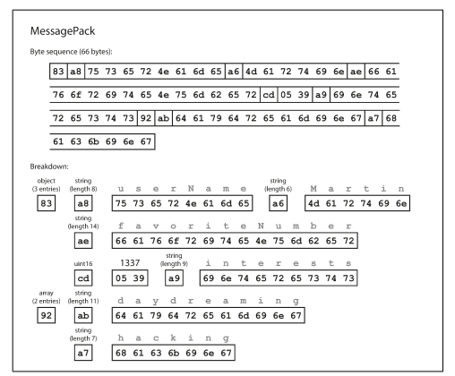
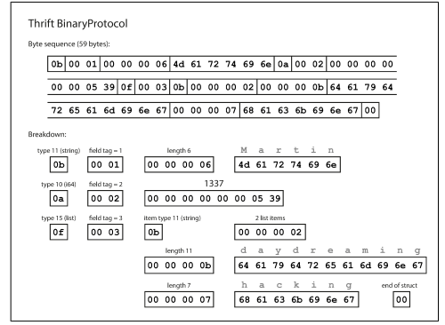
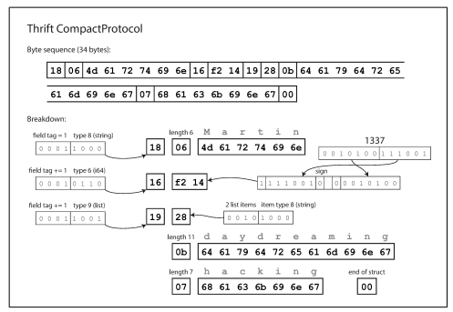
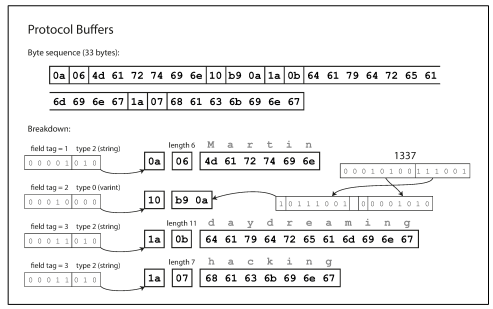
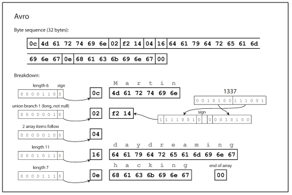
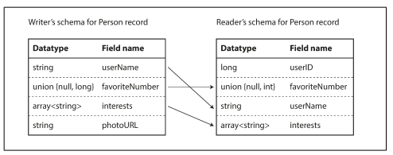
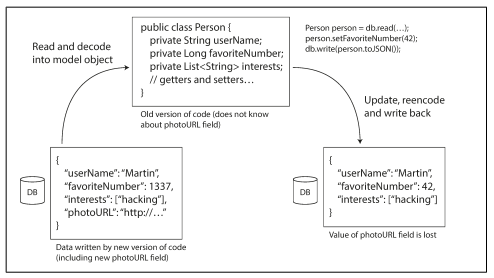

# 부호화와 발전

## 1. 데이터 부호화 형식
데이터를 파일에 쓰거나 네트워크를 통해 전송하려면 바이트열의 형태로 부호화해야 한다.
포인터는 다른 프로세스가 이해할 수 없기 때문이다.
여기서 인 메모리 표현을 바이트열로 전환하는 것을 부호화(직렬화나 마샬링)
그 반대를 복호화(파싱, 역직렬화, 언마샬링)

## 2. 언어별 형식
많은 프로그래밍 언어는 인메모리 객체를 바이트열로 부호화하는 기능을 내장한다.
바이트열의 특성상 인메모리 객체를 파일형태로 저장하고 복원할 수 있기 때문에 매우 편리하지만 문제점이 많다.
 - 다른 프로그래밍 언어에서 읽기 어렵다.
 - 객체 유형의 데이터를 복호화 하려면 클래스를 인스턴스화 할 수 있어야 하는데, 이때 바이트열을 복호화할 수 있는 애플리케이션을 얻을 수 있으면 보안상 문제가 될 수 있다.
 - 데이터 버전 관리를 보통 부호화 라이브러리에서 나중에 생각하게된다. 결국 데이터의 상위, 하위 호환성 문제가 등한시 되기도 한다.
 - 효율성도 나중에 생각하게 된다.

때문에 일시적인 목적 외에 언어에 내장된 부호화를 사용하는 방식은 일반적으로 좋지 않다.

## 3. Json과 xml, 이진 변형, 이진 부호화
XML: 너무 장황하고 불필요하게 복잡하다.
JSON : 주로 웹 브라우저에서 사용한다.
CSV: 스키마가 없어서 애플리케이션에서 처리해야 한다.
이런 결점에도 위 세개는 다양한 용도에 사용하기에 충분하다. 다만 다른 조직의 동의를 얻어 사용하는 것이 어려울 뿐이다.

## 4. 이진 부호화(BCD)
이진 부호화는 십진수를 비트열로 표현한 것이다.
json과 xml을 이진부호화 했을 때 데이터 크기가 좀 더 작아진다. 이는 테라바이트 정도가 되면 큰 차이를 보인다.
```c
struct Person {
 1: required string userName,
 2: optional i64 favoriteNumber,
 3: optional list<string> interests
}
```
위 예시를 통해 이진 부호화를 한 결과이다.


 - 첫번째 바이트 0x83은 객체의 시작을 알리는 바이트이자 읽을 데이터에 대한 설명이다.
  (하위 4비트 0x03은 세개의 필드, 상위 0x08은 객체)
  (지금은 1바이트로 표현되었는데, 1바이트 이상이 들어오게 되면 다른 타입 지시자를 얻어 필드 수를 2 또는 4바이트로 부호화한다.)
 - 그 다음 0xa8 현재 필드에 대한 뜻으로 다음과 같다. (하위 0x08은 문자열 길이, 상위 0xa0은 문자열)
 - 다음 8바이트는 “userName” 이라는 문자를 아스키 코드로 나타낸 값
 - 다음 6바이트는 위와 같다.
있는 그대로의 문자열({"userName":"martin","favoriteNumber":1337,"interests":["daydreaming","hacking"]}) 보다 데이터 길이가 좀 더 절약되었다.(81->66바이트로)

## 5. 스리프트와 프로토콜 버퍼
아파치 스리프트와 프로토콜 버퍼는 같은 원리를 기반으로 한 이진 부호화 라이브러리다.
스트리프와 프로토콜 버퍼는 부호화 하려면 스키마가 필요하다.

Thrift
```c
struct Person {
    1: required string  userName,
    2: optional i64     favoriteNumber
    3: optional list<string> interests
}
```

protocal buffer
```protocal
message Person {
    required string user_name       = 1;
    optional int64 favorite_number  = 2;
    reqeated string interests       = 3;
}
```

스트리트와 프로토콜 버퍼는 위와 같은 형태로 스키마를 구현한 클래스를 생성한다.
위 스키마를 스프리트는 바이너리와 컴팩트 프로토콜이라는 이진 부호화로 변환한다.

##### 바이너리 프로토콜(59byte로 압축)


바이너리 프로토콜은 이진 부호화와 마찬가지로 타입주석(annotation)이 있고, 길이, 문자열이 표시되어 있다.
이진 부호화와 큰 차이점은 필드명이 없다. 대신 필드 태그를 사용해서 구분짓는다.

컴팩트 프로토콜 부호화는 의미상으론 바이너리 프로토콜과 같지만, 동일한 정보를 더 줄여서(34byte) 표현한다.

##### 컴팩트 프로토콜(34byte로 압축)

필드 타입과 태그 숫자를 단일 바이트로 줄이고 가변 길이 정수를 사용해 부호화 한다.
즉, -64 ~ 63을 1바이트, -8192 ~ 8191까지 2바이트로 부호화 한다는 의미이다.

프로토콜 버퍼는 동일한 데이터를 부호화 한다.
비트를 줄여 저장하는 처리 방식이 약간 다르지만 컴팩트 프로토콜과 매우 비슷하다.

##### 프로토콜 버퍼(33byte로 압축)


## 6 필드 태그와 스키마 빌전
시간이 지남에 따라 스키마 발전이 변화했다. 이를 스키마 발전이라고 부른다.
스리프트와 프로토콜 버퍼는 하위 호환성과 상위 호환성을 유지하면서 어떻게 스키마를 변경했을까?

상위 호환성을 유지하기 위해서 필드에 새로운 태그 번호를 부여하는 방식으로 스키마에 새로운 필드를 추가한다.
예전 코드에서 새로운 코드로 기록한 데이터를 읽으려는 경우, 모르는 필드 번호는 무시하는 방식으로 호환성을 유지한다.

하위 호환성 유지하기 위해서는 새로 추가되는 필드를 required할 수 없기 때문에, 추가되는 필드를 optional로 하거나 기본값으로 가져가야 한다.

## 7. 데이터타입과 스키마 발전
필드의 데이터 타입을 변경하는 것은 위험하다.
32비트 정수를 64비트 정수로 바꾼다고 가정한다면, 기존 32비트씩 값을 읽다가 64비트 값을 읽게되면 값이 짤려서 읽힐 수 있다.
프로토콜 버퍼가 가진 기능중 하나는 repeated 표시자가 있다.
이는 단일 값인 optional을 repeated로 변경해도 문제가 없으며,
repeated는 0개나 1개의 엘리먼트가 있는 목록으로 보게되고 새로운 데이터를 읽는 예전 코드는 목록의 마지막 엘리먼트만 보게된다.

스프리트에는 전용 목록 데이터타입이 있다. 목록 데이터타입은 엘리먼트의 데이터타입을 매개변수로 받는다.
목록 데이터타입은 다중 값을 허용하지 않지만, 중복을 허용한다는 장점이 있다.

## 8. 아브로
아파치 아브로는 프로토콜 버퍼와 스프리트와는 다르지만 이들과 대저할 만한 또 하나의 이진 부호화 형식이다.
아브로는 하둡의 하위 프로젝트로 시작되었다.
아브로는 IDL과 JSON기반이 있다.

아브로 IDL
```avor
record Person {
    string               userName;
    union { null, long } favoriteNumber = null;
    array<string>        interests;
}
```

아브로 JSON
```json
{
    "type": "record",
    "name": "Person",
    "fields": [
        {"name": "userName",        "type": "string"},
        {"name": "favoriteNumber",  "type": ["null", "long"], "default": null},
        {"name": "interests",       "type": {"type": "array", "items": "string"}}
    ]
}

```

아브로는 스키마에 태그 번호가 없다. 아브로는 이진 부호화를 하면 길이가 32byte로 살펴본 모든 부호화 길이중 가장 짧다.
아브로를 이용해 이진 데이터를 파싱하려면 스키마에 나타난 순서대로 필드를 살펴보고 스키마를 이용해 데이터 타입을 미리 파악해야 한다.
이는 코드와 정확히 같은 스키마를 사용해야 하는 경우에만 이진 데이터를 올바르게 복구할 수 있다.
읽기와 쓰기 간 스키마가 불일치 한다면 데이터 복호화가 정확하지 않다는 의미이다.

## 8-1 아브로 쓰기와 읽기 스키마
아브로의 핵심은 쓰기 스키마와 읽기 스키마가 동일하지 않아도 되며, 단지 호환이 가능하면 된다.
아브로에서는 데이터를 읽을때 쓰기와 읽기 스키마를 검색하고 쓰기 스키마에서 읽기 스키마로 데이터를 변환해 그 차이를 해소한다.


데이터를 읽는 코드가 쓰기 스키마에 포함돼지 않는 경우 읽기 스키마에 선언된 기본 값으로 채운다.

아브로의 스키마 발전 규칙에는 호환성을 유지하기 위해 기본값이 있는 필드만 추가하거나 삭제할 수 있다.
(예를들어 필드를 추가해 새로운 스키마에는 있고, 예전 스키마에는 없다고 가정해보자.
새로운 스키마를 사용하는 읽기가 예전 스키마로 기록된 레코드를 읽으면 누락된 필드는 기본값으로 채워진다.)

## 9. 쓰기 스키마란?
### 동적 생성 스키마
다른 부호화 방식에 비해, 아브로에는 스키마에 태그 번호가 포함돼 있지 않다.
이 점은, 아브로는 동적 생성 스키마에 더 친숙하다는 점 이다.

아브로를 이진 형식으로 사용했을 때, 아브로 스키마를 상당히 쉽게 생성할 수 있다.
(부호화 자체가 간단함으로)
이 스키마를 이용해 데이터베이스 내용을 부호화하고 아브로 객체 컨테이너 파일로 모두 덤프할 수 있다.
각 데이터베이스 테이블에 맞게 레코드 스키마를 생성하고 각 칼럼은 해당 레코드의 필드가 된다.

여기서 데이터베이스 스키마가 변경된다고 가정한다면
 - 갱신된 데이터베이스 스키마로부터 새로운 아브로 스키마를 생성하고 새로운 아브로 스키마로 데이터를 내보낸다.
 - 데이터를 내보내는 과정은 스키마 변경에 신경 쓸 필요가 없다.
 - 새로운 데이터 파일을 읽는 사람은 레코드 필드가 변경된 사실을 알게 되지만,
   필드는 이름으로 식별되기 때문에 갱신된 쓰기 스키마는 여전히 이전 읽기 스키마와 매치 가능하다.

이에 반해 스리프트나 프로토콜 버퍼를 이용하면 필드 태그를 수동으로 할당해야만 한다.

### 코드 생성과 동적 타입 언어
스리프트와 프로토콜 버퍼는 코드 생성에 의존한다.
스키마를 정의한 후 선택한 프로그래밍 언어로 스키마를 구현한 코드를 생성할 수 있다.
C++, C#, JAVA같은 정적 타입 언어에서 유용하다.
이유는 복호화한 데이터를 인메모리 구조로 사용할 수 있기 때문.

아브로는 정적 타입 프로그래밍 언어를 위해 코드 생성을 선택적으로 제공한다.
객체 컨테이너 파일이 있으면 JSON파일을 보는 것과 같이 데이터를 볼 수 있다.
즉, 아브로는 파일만 있다면 즉시 열어서 분석할 수 있다.

### 스키마의 장점
 - 아브로 스키마 언어는 XML이나 JSON보다 훨씬 간단하다.
 - 유효성 검사를 지원한다.
 - 광범위한 프로그래밍 언어를 지원하는 방향으로 성장중.

아브로 스키마를 이진 부호화했을 때 좋은 속성은 다음과 같다.
 - 필드 이름을 생략할 수 있기 때문에 다른 이진부호화에 비해 크기가 훨씩 작을 수 있다.
 - 복호화 할 때 마다 스키마가 필요하기 때문에 스키마가 최신 상태인지 확인할 수 있다.
 - 스키마 변경이 적용되기 전에 상위 호환성과 하위 호환성을 확인할 수 있다.

아브로 스키마의 발전은 스키마리스 또는 읽기 스키마 데이터 베이스가 제공하는 것과 동일한 종류의 유연성을 제공하며 데이터나 도구 지원도 잘 보장한다.

## 9.데이터플로 모드
데이터 베이스의 레코드에 새로운 필드를 추가하게되면 다음과 같은 고려사항이 필요하다.
 - 상위, 하위 호환성 체크
 - 데이터 베이스에 접근하는 여러 프로세스(애플리케이션)의 업데이트

만약 애플리케이션 업데이트가 제대로 안되었다면 그림과 같이 데이터 유실이 발생할 수 있다.
해결 방법은 변경된 사실을 알고 있으면 된다.(당연한 말...)

### 다양한 시점에 기록된 다양한 값
애플리케이션은 배포되면 새로운 버전으로 완전히 대체할 수 있지만,
데이터베이스의 내용은 그렇지않다. 때문에 5년된 데이터는 명시적으로 다시 기록하지 않는 한
원래의 부호화 상태 그대로 있다.
이를 데이터가 코드보다 더 오래산다(data outlives code)라고 한다.

데이터를 새로운 스키마로 다시 기록하는 작업(마이그레이션)은 분명 가능하다.
하지만 대용량 데이터셋 대상으로는 값비싼 작업이기 때문에 이런 상황은 피한다.
대부분의 관계형 데이터베이스는 기존 데이터를 다시 기록하지 않고,
null을 기본값으로 갖는 새로운 칼럼을 추가하는 간단한 스키마 변경을 허용한다.
(단, MySQL은 예외이다. 꼭 필요하지 않은 상황에서도 전체 테이블을 다시 기록한다.)

참고로 링크드인의 문서 데이터베이스인 에스프레소는 아브로를 사용한다.
